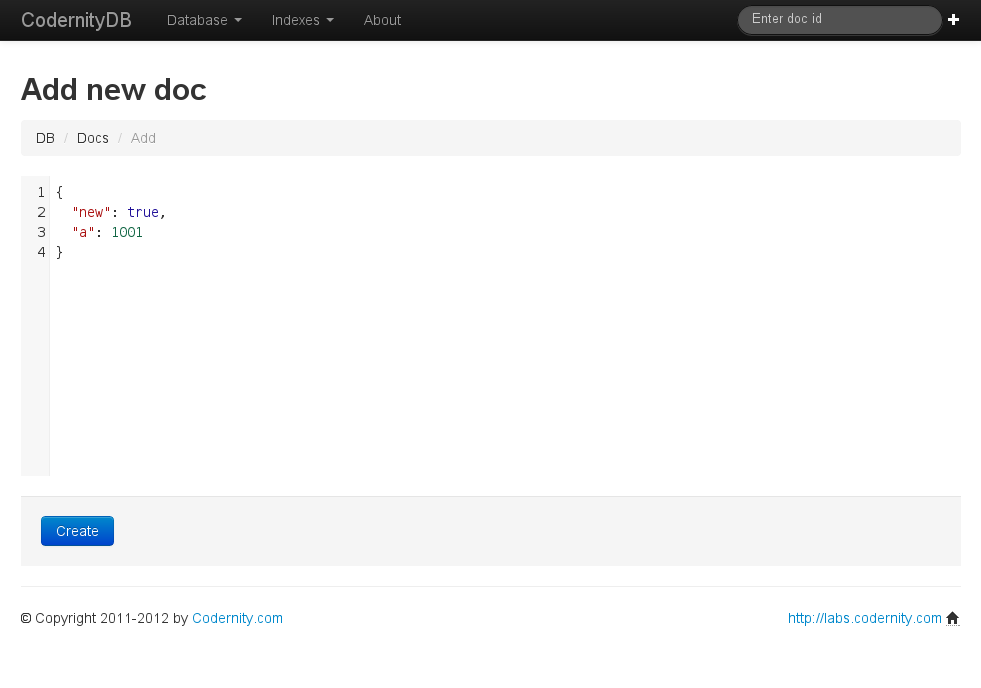
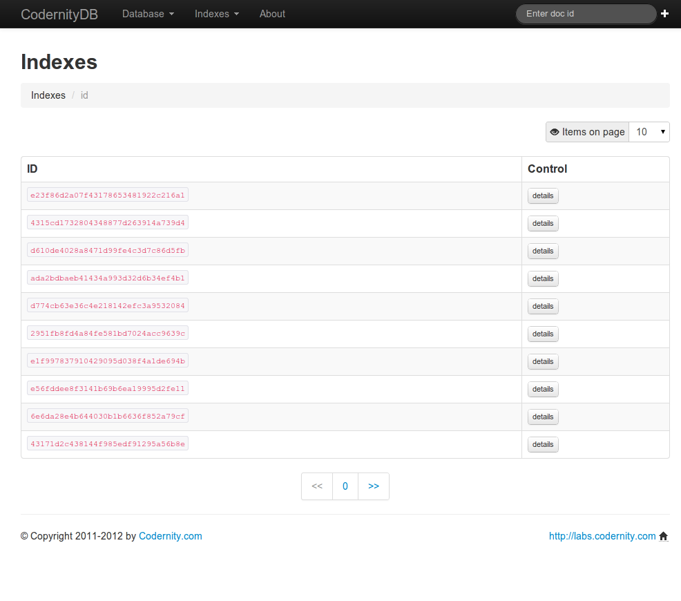

.. _server:

==============
Server version
==============

CodernityDB can be used in *embedded* mode or in server mode.

HTTP
-----

Currently there is **HTTP** server released. Visit |CodernityDB-HTTP-link| for more information and documentation.

There exists also CodernityDBPyClient which is an HTTP server
CodernityDB client that behaves in the same way as *embedded*
database. **You will need to add just 2 lines in your code to make use of it!** Visit |CodernityDB-PyClient-link| for more information and documentation.

.. note::
    Do you know that CodernityDBPyClient test suite uses the same code
    as CodernityDB test suite ?

Here you will find some screen shots from the interface:

.. image:: CodernityDB_HTTP_index_overview.png

.. _http_server_doc: http://labs.codernity.com/codernitydb-http
.. _codernity_db_py_client: http://labs.codernity.com/codernitydb-pyclient
